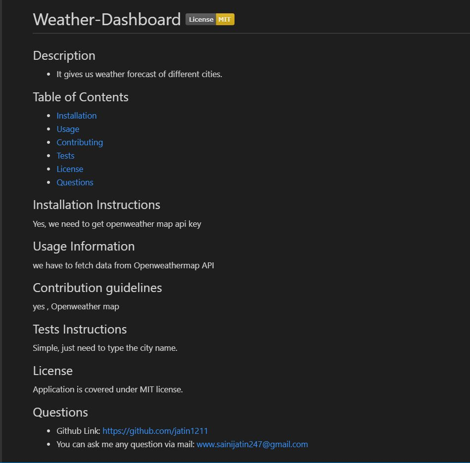

# Readme-Generator

## Description
To generate a high quality readme file by using using data provided by user interface through command line.

## User story
### As a user:
I WANT a README generator

### So that:
I can quickly create a professional README for a new project

## Table of Contents
* [Installation](#installation)
* [Usage](#usage)
* [Technologies used](#technologies-used)
* [License](#license)
* [Contribution](#contribution)
* [Screenshot](#screenshot)
* [Walkthrough video](#walkthrough-video)
* [Questions](#questions)

## Installation
Please clone the repo to your local machine and do `npm i` to install all the packages used. Then run `node index.js` from the Integrated terminal of Visual studio code or GitBash

## Usage
* The user is prompted for information about their application repository
* A high-quality, professional README.md is generated with the title of my project and sections entitled Description, Table of Contents, Installation, Usage, License, Contributing, Tests, and Questions
* A table of contents containing corresponding section links is created.

## Technologies used

## License

## Contribution
- [Jatin Saini](https://github.com/jatin1211)

## Screenshots

## Walkthrough video
https://drive.google.com/file/d/1Cndc-BSnuEhXCWyXZnnJc5CrsXYPZf9X/view

## Questions
Please email me with questions!
* sainijatin247@gmail.com